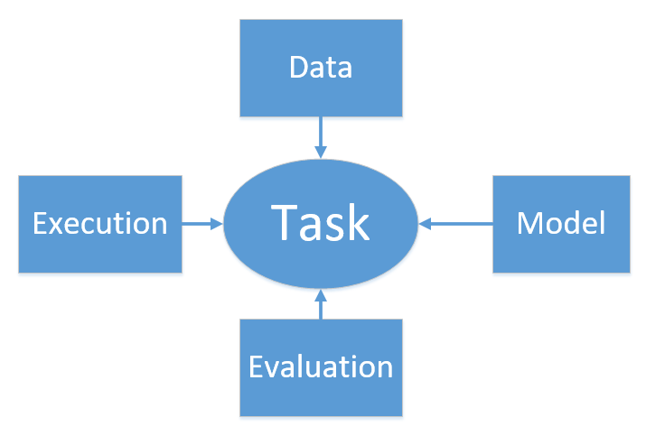

# Deep Learning Framework based on Numpy

## Requirements
 
- Python3
- Numpy
- Matplotlib
- Scipy
- xlwt
- scikit-learn

## Design philosophy
In every task, **_the operation flow/process is unchanged_** and **_the only changing 
thing is just the specific operation in each process_**. (业务流程是不变的，变化的
只是具体的业务。)

Every artificial intelligence(AI) task involves four components: **Model**, **Data**, 
**Execution** and **Evaluation**. 

## Features

- Support basic automatic differentiation;
- Support commonly used models, such as MLP, RNNs LSTMs and convnets.
- Support visualization of evaluation results.

