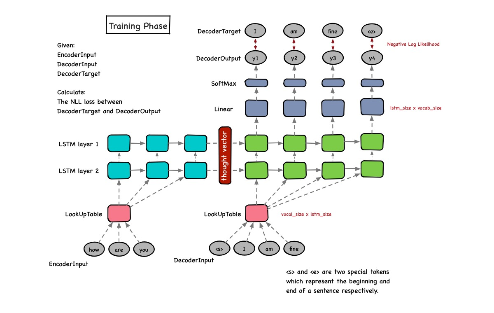
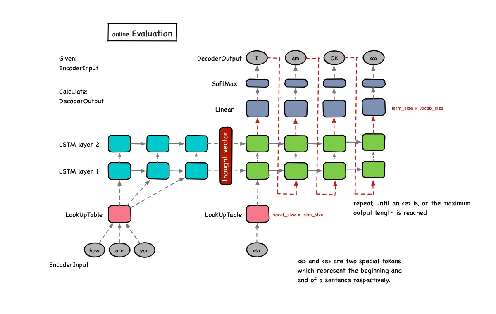

# Chatbot

## Usage

Step 1: download pretrained model.

    https://pan.baidu.com/s/1o7MtdhC

Step 2: Decompress ``data.tar.gz`` into the ``data`` directory.

    mkdir applications/chatbot/data
    cd applications/chatbot/data
    tar -xzf data.tar.gz applications/chatbot/data

Step 3: install ``Flask``.
    
    conda install flask
    
or

    pip install flask

Step 4: Run ``main.py`` script.
    
    python main.py

Step 5: Open your favourite browser, and enjoy!

    http://127.0.0.1:5000/

## Example 

## seq2seq

Training Phase:

Evaluation Phase:

 