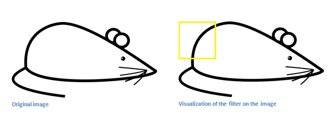
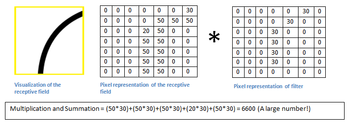
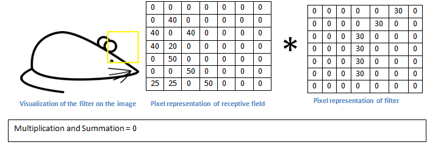
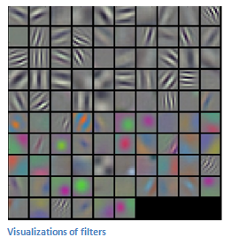
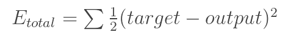
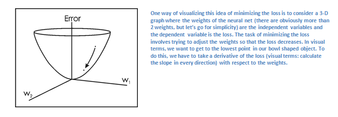
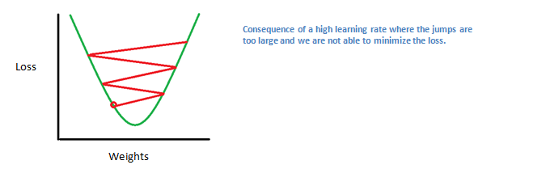

===========================
Convolution Neural Networks
===========================

1. Introduction
===============

Inputs and Outputs
------------------

When a computer sees an image (takes an image as input), it will see an 
array of pixel values. Depending on the resolution and size of the image, 
it will see a 32 x 32 x 3 array of numbers (The 3 refers to RGB values). 
Just to drive home the point, let's say we have a color image in JPG form 
and its size is 480 x 480. The representative array will be 480 x 480 x 3. 
Each of these numbers is given a value from 0 to 255 which describes the 
pixel intensity at that point. These numbers, while meaningless to us 
when we perform image classification, are the only inputs available to the 
computer.  The idea is that you give the computer this array of numbers 
and it will output numbers that describe the probability of the image 
being a certain class (.80 for cat, .15 for dog, .05 for bird, etc).

What We Want the Computer to Do
-------------------------------

When we look at a picture of a dog, we can classify it as such if the picture
has identifiable features such as paws or 4 legs. In a similar way, the computer
is able perform image classification by looking for low level features such as 
edges and curves, and then building up to more abstract concepts through a 
series of convolutional layers. This is a general overview of what a CNN does. 
Let’s get into the specifics.

Structure
---------

A more detailed overview of what CNNs do would be that you take the image, 
pass it through a series of convolutional, nonlinear, pooling (downsampling), 
and fully connected layers, and get an output. As we said earlier, the output 
can be a single class or a probability of classes that best describes the image. 
Now, the hard part is understanding what each of these layers do. 
So let’s get into the most important one.

First Layer – Math Part
^^^^^^^^^^^^^^^^^^^^^^^

The first layer in a CNN is always a Convolutional Layer. First thing to make sure 
you remember is what the input to this conv (I’ll be using that abbreviation a lot) layer is. 
Like we mentioned before, the input is a 32 x 32 x 3 array of pixel values. Now, the best way to explain a conv layer is to imagine a flashlight that is shining over the top left of the image. Let’s say that the light this flashlight shines covers a 5 x 5 area. And now, let’s imagine this flashlight sliding across all the areas of the input image. In machine learning terms, this flashlight is called a filter(or sometimes referred to as a neuron or a kernel) and the region that it is shining over is called the receptive field. Now this filter is also an array of numbers (the numbers are called weights or parameters). A very important note is that the depth of this filter has to be the same as the depth of the input (this makes sure that the math works out), so the dimensions of this filter is 5 x 5 x 3. Now, let’s take the first position the filter is in for example.  It would be the top left corner. 

.. image:: pics/1.png

As the filter is sliding, or convolving, around the input image, it is multiplying the values in the filter with the original pixel values of the image (aka computing element wise multiplications). These multiplications are all summed up (mathematically speaking, this would be 75 multiplications in total). So now you have a single number. Remember, this number is just representative of when the filter is at the top left of the image. Now, we repeat this process for every location on the input volume. (Next step would be moving the filter to the right by 1 unit, then right again by 1, and so on). Every unique location on the input volume produces a number. After sliding the filter over all the locations, you will find out that what you’re left with is a 28 x 28 x 1 array of numbers, which we call an activation map or feature map. The reason you get a 28 x 28 array is that there are 784 different locations that a 5 x 5 filter can fit on a 32 x 32 input image. These 784 numbers are mapped to a 28 x 28 array.

.. image:: pics/6.gif

Let’s say now we use two 5 x 5 x 3 filters instead of one. Then our output volume would be 28 x 28 x 2. By using more filters, we are able to preserve the spatial dimensions better. Mathematically, this is what’s going on in a convolutional layer.

First Layer – High Level Perspective
^^^^^^^^^^^^^^^^^^^^^^^^^^^^^^^^^^^^

However, let’s talk about what this convolution is actually doing from a high level. Each of these filters can be thought of as feature identifiers. When I say features, I’m talking about things like straight edges, simple colors, and curves. Think about the simplest characteristics that all images have in common with each other. Let’s say our first filter is 7 x 7 x 3 and is going to be a curve detector. (In this section, let’s ignore the fact that the filter is 3 units deep and only consider the top depth slice of the filter and the image, for simplicity.)As a curve detector, the filter will have a pixel structure in which there will be higher numerical values along the area that is a shape of a curve (Remember, these filters that we’re talking about as just numbers!).  

.. image:: pics/Filter.png

Now, let’s go back to visualizing this mathematically. When we have this filter at the top left corner of the input volume, it is computing multiplications between the filter and pixel values at that region. Now let’s take an example of an image that we want to classify, and let’s put our filter at the top left corner.

Remember, what we have to do is multiply the values in the filter with the original pixel values of the image.

Basically, in the input image, if there is a shape that generally resembles the curve that this filter is representing, then all of the multiplications summed together will result in a large value! Now let’s see what happens when we move our filter.

The value is much lower! This is because there wasn’t anything in the image section that responded to the curve detector filter. Remember, the output of this conv layer is an activation map. So, in the simple case of a one filter convolution (and if that filter is a curve detector), the activation map will show the areas in which there at mostly likely to be curves in the picture. In this example, the top left value of our 28 x 28 x 1 activation map will be 6600. This high value means that it is likely that there is some sort of curve in the input volume that caused the filter to activate. The top right value in our activation map will be 0 because there wasn’t anything in the input volume that caused the filter to activate (or more simply said, there wasn’t a curve in that region of the original image). Remember, this is just for one filter. This is just a filter that is going to detect lines that curve outward and to the right. We can have other filters for lines that curve to the left or for straight edges. The more filters, the greater the depth of the activation map, and the more information we have about the input volume.

Disclaimer: The filter I described in this section was simplistic for the main purpose of describing the math that goes on during a convolution. In the picture below, you’ll see some examples of actual visualizations of the filters of the first conv layer of a trained network. Nonetheless, the main argument remains the same. The filters on the first layer convolve around the input image and “activate” (or compute high values) when the specific feature it is looking for is in the input volume.

(Quick Note: The above image came from Stanford's CS 231N course taught by Andrej Karpathy and Justin Johnson. Recommend for anyone looking for a deeper understanding of CNNs.)

Going Deeper Through the Network
^^^^^^^^^^^^^^^^^^^^^^^^^^^^^^^^

Now in a traditional convolutional neural network architecture, there are other layers that are interspersed between these conv layers. I’d strongly encourage those interested to read up on them and understand their function and effects, but in a general sense, they provide nonlinearities and preservation of dimension that help to improve the robustness of the network and control overfitting. A classic CNN architecture would look like this.

.. image:: pics/Table.png
The last layer, however, is an important one and one that we will go into later on. Let’s just take a step back and review what we’ve learned so far. We talked about what the filters in the first conv layer are designed to detect. They detect low level features such as edges and curves. As one would imagine, in order to predict whether an image is a type of object, we need the network to be able to recognize higher level features such as hands or paws or ears. So let’s think about what the output of the network is after the first conv layer. It would be a 28 x 28 x 3 volume (assuming we use three 5 x 5 x 3 filters).  When we go through another conv layer, the output of the first conv layer becomes the input of the 2nd conv layer.  Now, this is a little bit harder to visualize. When we were talking about the first layer, the input was just the original image. However, when we’re talking about the 2nd conv layer, the input is the activation map(s) that result from the first layer. So each layer of the input is basically describing the locations in the original image for where certain low level features appear. Now when you apply a set of filters on top of that (pass it through the 2nd conv layer), the output will be activations that represent higher level features. Types of these features could be semicircles (combination of a curve and straight edge) or squares (combination of several straight edges). As you go through the network and go through more conv layers, you get activation maps that represent more and more complex features. By the end of the network, you may have some filters that activate when there is handwriting in the image, filters that activate when they see pink objects, etc. If you want more information about visualizing filters in ConvNets, Matt Zeiler and Rob Fergus had an excellent research paper discussing the topic. Jason Yosinski also has a video on YouTube that provides a great visual representation. Another interesting thing to note is that as you go deeper into the network, the filters begin to have a larger and larger receptive field, which means that they are able to consider information from a larger area of the original input volume (another way of putting it is that they are more responsive to a larger region of pixel space).

Fully Connected Layer
^^^^^^^^^^^^^^^^^^^^^

Now that we can detect these high level features, the icing on the cake is attaching a fully connected layer to the end of the network. This layer basically takes an input volume (whatever the output is of the conv or ReLU or pool layer preceding it) and outputs an N dimensional vector where N is the number of classes that the program has to choose from. For example, if you wanted a digit classification program, N would be 10 since there are 10 digits. Each number in this N dimensional vector represents the probability of a certain class. For example, if the resulting vector for a digit classification program is [0 .1 .1 .75 0 0 0 0 0 .05], then this represents a 10% probability that the image is a 1, a 10% probability that the image is a 2, a 75% probability that the image is a 3, and a 5% probability that the image is a 9 (Side note: There are other ways that you can represent the output, but I am just showing the softmax approach). The way this fully connected layer works is that it looks at the output of the previous layer (which as we remember should represent the activation maps of high level features) and determines which features most correlate to a particular class. For example, if the program is predicting that some image is a dog, it will have high values in the activation maps that represent high level features like a paw or 4 legs, etc. Similarly, if the program is predicting that some image is a bird, it will have high values in the activation maps that represent high level features like wings or a beak, etc. Basically, a FC layer looks at what high level features most strongly correlate to a particular class and has particular weights so that when you compute the products between the weights and the previous layer, you get the correct probabilities for the different classes.

.. image:: pics/LeNet.png

Training (AKA:What Makes this Stuff Work)
-----------------------------------------

Now, this is the one aspect of neural networks that I purposely haven’t mentioned yet and it is probably the most important part. There may be a lot of questions you had while reading. How do the filters in the first conv layer know to look for edges and curves? How does the fully connected layer know what activation maps to look at? How do the filters in each layer know what values to have? The way the computer is able to adjust its filter values (or weights) is through a training process called backpropagation.

Before we get into backpropagation, we must first take a step back and talk about what a neural network needs in order to work. At the moment we all were born, our minds were fresh. We didn’t know what a cat or dog or bird was. In a similar sort of way, before the CNN starts, the weights or filter values are randomized. The filters don’t know to look for edges and curves. The filters in the higher layers don’t know to look for paws and beaks. As we grew older however, our parents and teachers showed us different pictures and images and gave us a corresponding label. This idea of being given an image and a label is the training process that CNNs go through. Before getting too into it, let’s just say that we have a training set that has thousands of images of dogs, cats, and birds and each of the images has a label of what animal that picture is. Back to backprop.

So backpropagation can be separated into 4 distinct sections, the forward pass, the loss function, the backward pass, and the weight update. During the forward pass, you take a training image which as we remember is a 32 x 32 x 3 array of numbers and pass it through the whole network. On our first training example, since all of the weights or filter values were randomly initialized, the output will probably be something like [.1 .1 .1 .1 .1 .1 .1 .1 .1 .1], basically an output that doesn’t give preference to any number in particular. The network, with its current weights, isn’t able to look for those low level features or thus isn’t able to make any reasonable conclusion about what the classification might be. This goes to the loss function part of backpropagation. Remember that what we are using right now is training data. This data has both an image and a label. Let’s say for example that the first training image inputted was a 3. The label for the image would be [0 0 0 1 0 0 0 0 0 0]. A loss function can be defined in many different ways but a common one is MSE (mean squared error), which is ½ times (actual - predicted) squared.

Let’s say the variable L is equal to that value. As you can imagine, the loss will be extremely high for the first couple of training images. Now, let’s just think about this intuitively. We want to get to a point where the predicted label (output of the ConvNet) is the same as the training label (This means that our network got its prediction right).In order to get there, we want to minimize the amount of loss we have. Visualizing this as just an optimization problem in calculus, we want to find out which inputs (weights in our case) most directly contributed to the loss (or error) of the network.

This is the mathematical equivalent of a dL/dW where W are the weights at a particular layer. Now, what we want to do is perform a backward pass through the network, which is determining which weights contributed most to the loss and finding ways to adjust them so that the loss decreases. Once we compute this derivative, we then go to the last step which is the weight update. This is where we take all the weights of the filters and update them so that they change in the direction of the gradient.

.. image:: pics/Weight.png
The learning rate is a parameter that is chosen by the programmer. A high learning rate means that bigger steps are taken in the weight updates and thus, it may take less time for the model to converge on an optimal set of weights. However, a learning rate that is too high could result in jumps that are too large and not precise enough to reach the optimal point.

The process of forward pass, loss function, backward pass, and parameter update is generally called one epoch. The program will repeat this process for a fixed number of epochs for each set of training images (commonly called a batch). Once you finish the parameter update on the last training example, hopefully the network should be trained well enough so that the weights of the layers are tuned correctly.
 
Testing
-------

Finally, to see whether or not our CNN works, we have a different set of images and labels (can’t double dip between training and test!) and pass the images through the CNN. We compare the outputs to the ground truth and see if our network works!
 
How Companies Use CNNs
----------------------
 
Data, data, data. The companies that have lots of this magic 4 letter word are the ones that have an inherent advantage over the rest of the competition. The more training data that you can give to a network, the more training iterations you can make, the more weight updates you can make, and the better tuned to the network is when it goes to production. Facebook (and Instagram) can use all the photos of the billion users it currently has, Pinterest can use information of the 50 billion pins that are on its site, Google can use search data, and Amazon can use data from the millions of products that are bought every day. And now you know the magic behind how they use it.
 
Disclaimer 
----------
 
While this post should be a good start to understanding CNNs, it is by no means a comprehensive overview. Things not discussed in this post include the nonlinear and pooling layers as well as hyperparameters of the network such as filter sizes, stride, and padding. Topics like network architecture, batch normalization, vanishing gradients, dropout, initialization techniques, non-convex optimization,biases, choices of loss functions, data augmentation,regularization methods, computational considerations, modifications of backpropagation, and more were also not discussed.

2. Understanding
================

Introduction
------------

In this post, we’ll go into a lot more of the specifics of ConvNets. Disclaimer: Now, I do realize that some of these topics are quite complex and could be made in whole posts by themselves. In an effort to remain concise yet retain comprehensiveness, I will provide links to research papers where the topic is explained in more detail.

Stride and Padding
------------------

Alright, let’s look back at our good old conv layers. Remember the filters, the receptive fields, the convolving? Good. Now, there are 2 main parameters that we can change to modify the behavior of each layer. After we choose the filter size, we also have to choose the stride and the padding.

Stride controls how the filter convolves around the input volume. In the example we had in part 1, the filter convolves around the input volume by shifting one unit at a time. The amount by which the filter shifts is the stride. In that case, the stride was implicitly set at 1. Stride is normally set in a way so that the output volume is an integer and not a fraction. Let’s look at an example. Let’s imagine a 7 x 7 input volume, a 3 x 3 filter (Disregard the 3rd dimension for simplicity), and a stride of 1. This is the case that we’re accustomed to.

.. image:: pics/Stride1.png
Same old, same old, right? See if you can try to guess what will happen to the output volume as the stride increases to 2.

.. image:: pics/Stride2.png
So, as you can see, the receptive field is shifting by 2 units now and the output volume shrinks as well. Notice that if we tried to set our stride to 3, then we’d have issues with spacing and making sure the receptive fields fit on the input volume. Normally, programmers will increase the stride if they want receptive fields to overlap less and if they want smaller spatial dimensions.

Now, let’s take a look at padding. Before getting into that, let’s think about a scenario. What happens when you apply three 5 x 5 x 3 filters to a 32 x 32 x 3 input volume? The output volume would be 28 x 28 x 3. Notice that the spatial dimensions decrease. As we keep applying conv layers, the size of the volume will decrease faster than we would like. In the early layers of our network, we want to preserve as much information about the original input volume so that we can extract those low level features. Let’s say we want to apply the same conv layer but we want the output volume to remain 32 x 32 x 3. To do this, we can apply a zero padding of size 2 to that layer. Zero padding pads the input volume with zeros around the border. If we think about a zero padding of two, then this would result in a 36 x 36 x 3 input volume.

.. image:: pics/Pad.png
If you have a stride of 1 and if you set the size of zero padding to

.. image:: pics/ZeroPad.png
where K is the filter size, then the input and output volume will always have the same spatial dimensions.

The formula for calculating the output size for any given conv layer is

.. image:: pics/Output.png
where O is the output height/length, W is the input height/length, K is the filter size, P is the padding, and S is the stride.

Choosing Hyper-parameters
-------------------------

How do we know how many layers to use, how many conv layers, what are the filter sizes, or the values for stride and padding? These are not trivial questions and there isn’t a set standard that is used by all researchers. This is because the network will largely depend on the type of data that you have. Data can vary by size, complexity of the image, type of image processing task, and more. When looking at your dataset, one way to think about how to choose the hyperparameters is to find the right combination that creates abstractions of the image at a proper scale.

ReLU (Rectified Linear Units) Layers
------------------------------------

After each conv layer, it is convention to apply a nonlinear layer (or activation layer) immediately afterward.The purpose of this layer is to introduce nonlinearity to a system that basically has just been computing linear operations during the conv layers (just element wise multiplications and summations).In the past, nonlinear functions like tanh and sigmoid were used, but researchers found out that ReLU layers work far better because the network is able to train a lot faster (because of the computational efficiency) without making a significant difference to the accuracy. It also helps to alleviate the vanishing gradient problem, which is the issue where the lower layers of the network train very slowly because the gradient decreases exponentially through the layers (Explaining this might be out of the scope of this post, but see here and here for good descriptions). The ReLU layer applies the function f(x) = max(0, x) to all of the values in the input volume. In basic terms, this layer just changes all the negative activations to 0.This layer increases the nonlinear properties of the model and the overall network without affecting the receptive fields of the conv layer.

`Paper <http://www.cs.toronto.edu/~fritz/absps/reluICML.pdf>`_ by the great Geoffrey Hinton (aka the father of deep learning).

Pooling Layers
--------------

After some ReLU layers, programmers may choose to apply a pooling layer. It is also referred to as a downsampling layer. In this category, there are also several layer options, with maxpooling being the most popular. This basically takes a filter (normally of size 2x2) and a stride of the same length. It then applies it to the input volume and outputs the maximum number in every subregion that the filter convolves around.

.. image:: pics/MaxPool.png
Other options for pooling layers are average pooling and L2-norm pooling. The intuitive reasoning behind this layer is that once we know that a specific feature is in the original input volume (there will be a high activation value), its exact location is not as important as its relative location to the other features. As you can imagine, this layer drastically reduces the spatial dimension (the length and the width change but not the depth) of the input volume. This serves two main purposes. The first is that the amount of parameters or weights is reduced by 75%, thus lessening the computation cost. The second is that it will control overfitting. This term refers to when a model is so tuned to the training examples that it is not able to generalize well for the validation and test sets. A symptom of overfitting is having a model that gets 100% or 99% on the training set, but only 50% on the test data.

Dropout Layers
--------------

Now, dropout layers have a very specific function in neural networks. In the last section, we discussed the problem of overfitting, where after training, the weights of the network are so tuned to the training examples they are given that the network doesn’t perform well when given new examples. The idea of dropout is simplistic in nature. This layer “drops out” a random set of activations in that layer by setting them to zero in the forward pass. Simple as that. Now, what are the benefits of such a simple and seemingly unnecessary and counterintuitive process? Well, in a way, it forces the network to be redundant. By that I mean the network should be able to provide the right classification or output for a specific example even if some of the activations are dropped out. It makes sure that the network isn’t getting too “fitted” to the training data and thus helps alleviate the overfitting problem. An important note is that this layer is only used during training, and not during test time.

`Paper <https://www.cs.toronto.edu/~hinton/absps/JMLRdropout.pdf>`_ by Geoffrey Hinton.

Network in Network Layers
-------------------------

A network in network layer refers to a conv layer where a 1 x 1 size filter is used. Now, at first look, you might wonder why this type of layer would even be helpful since receptive fields are normally larger than the space they map to. However, we must remember that these 1x1 convolutions span a certain depth, so we can think of it as a 1 x 1 x N convolution where N is the number of filters applied in the layer. Effectively, this layer is performing a N-D element-wise multiplication where N is the depth of the input volume into the layer.

`Paper <https://arxiv.org/pdf/1312.4400v3.pdf>`_ by Min Lin.

Classification, Localization, Detection, Segmentation
-----------------------------------------------------

In the example we used in Part 1 of this series, we looked at the task of image classification. This is the process of taking an input image and outputting a class number out of a set of categories. However, when we take a task like object localization, our job is not only to produce a class label but also a bounding box that describes where the object is in the picture.

.. image:: pics/Localization.png
We also have the task of object detection, where localization needs to be done on all of the objects in the image. Therefore, you will have multiple bounding boxes and multiple class labels.

Finally, we also have object segmentation where the task is to output a class label as well as an outline of every object in the input image.

3. Reference
============

https://adeshpande3.github.io/adeshpande3.github.io/A-Beginner's-Guide-To-Understanding-Convolutional-Neural-Networks/
  
