===========================
Convolution Neural Networks
===========================

Introduction
============

Convolutional Neural Networks (CNN) are now a standard way of image classification –
there are publicly accessible deep learning frameworks, trained models and services.
It’s more time consuming to install stuff like caffe [1]_ than to perform state-of-the-art
object classification or detection. We also have many methods of getting knowledge -
there is a large number of deep learning courses [2]_ /MOOCs [3]_, free e-books [4]_ or
even direct ways of accessing to the strongest Deep/Machine Learning minds such as
Yoshua Bengio [5]_, Andrew NG [6]_ or Yann Lecun [7]_ by Quora, Facebook or G+.

Nevertheless, when I wanted to get deeper insight in CNN, I could not find a “CNN
backpropagation for dummies”. Notoriously I met with statements like:  “If you understand
backpropagation in standard neural networks, there should not be a problem with understanding
it in CNN” or “All things are nearly the same, except matrix multiplications are replaced by
convolutions”. And of course I saw tons of ready equations.

It was a little consoling, when I found out that I am not alone, for example: ``Hello, when
computing the gradients CNN,  the weights need to be rotated, Why ?`` [8]_

.. math::

    \delta_j^l = f'(u_j^l) \odot conv2(\delta_j^{l+1}, rot180(k_j^{l+1}), 'full')

The answer on above question, that concerns the need of rotation on weights in gradient
computing, will be a result of this long post.

Back Propagation
================

We start from multilayer perceptron and counting delta errors on fingers:

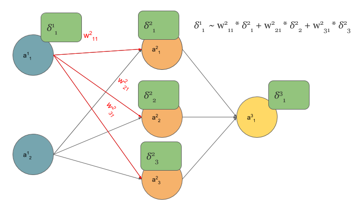

We see on above picture that :math:`\delta_1^1` is proportional to deltas from next layer
that are scaled by weights.

But how do we connect concept of MLP with Convolutional Neural Network? Let’s play with MLP:

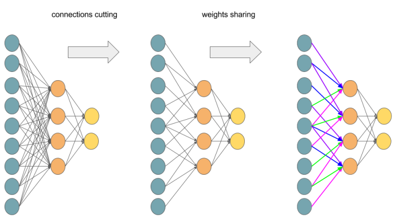

    Transforming Multilayer Perceptron to Convolutional Neural Network.

If you are not sure that after connections cutting and weights sharing we get one layer
Convolutional Neural Network, I hope that below picture will convince you:

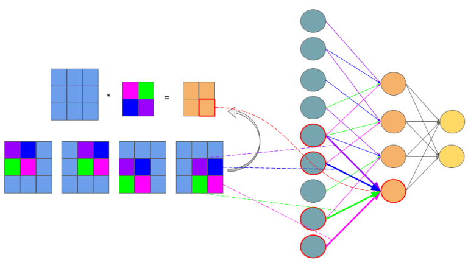

    Feedforward in CNN is identical with convolution operation.

The idea behind this figure is to show, that such neural network configuration  is identical
with a 2D convolution operation and weights are just filters (also called kernels, convolution
matrices, or masks).

Now we can come back to gradient computing by counting on fingers, but from now we will be only
focused on CNN. Let’s begin:

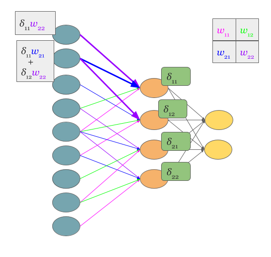

    Backpropagation also results with convolution.

No magic here, we have just summed in “blue layer” scaled by weights gradients from “orange”
layer. Same process as in MLP’s backpropagation. However, in the standard approach we talk about
dot products and here we have … yup, again convolution:

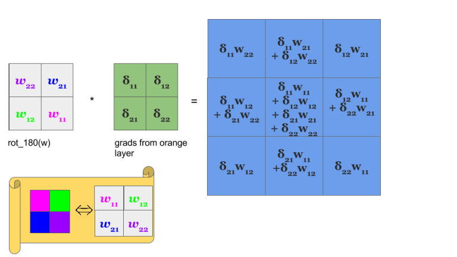

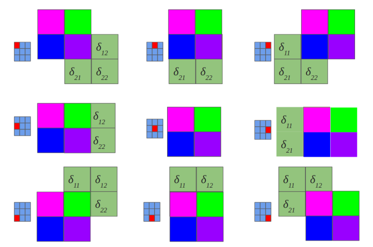

Yeah, it is a bit different convolution than in previous (forward) case. There we did so called
valid convolution, while here we do a full convolution (more about nomenclature here [9]_ ). What
is more, we rotate our kernel by 180 degrees. But still, we are talking about convolution!

Now, I have some good news and some bad news:

* you see (BTW, sorry for pictures aesthetics), that matrix dot products are replaced by
  convolution operations both in feed forward and backpropagation.
* you know that seeing something and understanding something … yup, we are going now to
  get our hands dirty and prove above statement before getting next, I recommend to read,
  mentioned already in the disclaimer, chapter 2 [10]_ of M. Nielsen book. I tried to make
  all quantities to be consistent with work of Michael.

In the standard MLP, we can define an error of neuron :math:`j` as:

.. math::

    \delta_j^l = \frac{\partial C}{\partial z_j^l}

where :math:`z_j^l` is just:

.. math::

    z^l_j = \sum_{k} w_{jk}^l a_k^{l-1} + b_j^l

and for clarity, :math:`a_j^l = \sigma(z_j^l)`, where :math:`\sigma` is an activation function
such as sigmoid, hyperbolic tangent or relu [11]_.

But here, we do not have MLP but CNN and matrix multiplications are replaced by
convolutions as we discussed before. So instead of :math:`z_j`  we do have a :math:`z_{x,y}`:

.. math::

    z_{x,y}^{l+1} = w^{l+1} * \sigma(z_{x,y}^l) + b_{x,y}^{l+1} =
    \sum_{a} \sum_{b} w_{a,b}^{l+1}\sigma(z_{x-a,y-b}^l)+ b_{x,y}^{l+1}

Above equation is just a convolution operation during feedforward phase illustrated in the
above picture titled ‘Feedforward in CNN is identical with convolution operation’[12]_

Now we can get to the point and answer the question ``Hello, when computing the gradients CNN,
the weights need to be rotated, Why ?`` [8]_

We start from statement:

.. math::

    \delta_{x,y}^l = \frac{\partial C}{\partial z_{x,y}^l} =
    \sum_{x'} \sum_{y'}\frac{\partial C}{\partial z_{x',y'}^{l+1}}
    \frac{\partial z_{x',y'}^{l+1}}{\partial z_{x,y}^l}

We know that :math:`z_{x,y}^l` is in relation to :math:`z_{x',y'}^{l+1}` which is indirectly
showed in  the above picture titled ‘Backpropagation also results with convolution’.
So sums are the result of chain rule. Let’s move on:

.. math::

    \frac{\partial C}{\partial z_{x,y}^l} & =
    \sum_{x'} \sum_{y'}\frac{\partial C}{\partial z_{x',y'}^{l+1}}
    \frac{\partial z_{x',y'}^{l+1}}{\partial z_{x,y}^l}  \\
    & = \sum_{x'} \sum_{y'} \delta_{x',y'}^{l+1}
    \frac{\partial(\sum_{a}\sum_{b}w_{a,b}^{l+1}
    \sigma(z_{x'-a, y'-b}^l) + b_{x',y'}^{l+1})}{\partial z_{x,y}^l}

First term is replaced by definition of error, while second has become large because we 
put it here expression on :math:`z_{x',y'}^{l+1}`. However, we do not have to fear of this 
big monster – all components of sums equal 0, except these ones that are 
indexed: :math:`x=x'-a` and :math:`y=y'-b`. So:

.. math::

    \sum_{x'} \sum_{y'} \delta_{x',y'}^{l+1}
    \frac{\partial(\sum_{a}\sum_{b}w_{a,b}^{l+1}
    \sigma(z_{x'-a, y'-b}^l) + b_{x',y'}^{l+1})}
    {\partial z_{x,y}^l} = \sum_{x'} \sum_{y'}
    \delta_{x',y'}^{l+1} w_{a,b}^{l+1} \sigma'(z_{x,y}^l)

If "math;`x=x'-a` and :math:`y=y'-b` then it is obvious that :math:`a=x'-x` and :math:`b=y'-y`
so we can reformulate above equation to:

.. math::

    \sum_{x'} \sum_{y'} \delta_{x',y'}^{l+1} w_{a,b}^{l+1}
    \sigma'(z_{x,y}^l) =\sum_{x'}\sum_{y'} \delta_{x',y'}^{l+1}
    w_{x'-x,y'-y}^{l+1} \sigma'(z_{x,y}^l)

OK, our last equation is just …

.. math::

    \sum_{x'}\sum_{y'} \delta_{x',y'}^{l+1} w_{x'-x,y'-y}^{l+1}
    \sigma'(z_{x,y}^l)= \delta^{l+1} * w_{-x,-y}^{l+1} \sigma'(z_{x,y}^l)

Where is the rotation of weights? Actually :math:`ROT180(w_{x,y}^{l+1}) = w_{-x, -y}^{l+1}`.

So the answer on question ``Hello, when computing the gradients CNN,  the weights need to be rotated,
Why ?`` [8]_  is simple: the rotation of the weights just results from derivation of delta error in
Convolution Neural Network.

OK, we are really close to the end. One more ingredient of backpropagation algorithm is update
of weights :math:`\frac{\partial C}{\partial w_{a,b}^l}`:

.. math::

    \frac{\partial C}{\partial w_{a,b}^l}
    & = \sum_{x} \sum_{y} \frac{\partial C}{\partial z_{x,y}^l}\frac{\partial z_{x,y}^l}{\partial w_{a,b}^l}  \\
    & = \sum_{x}\sum_{y}\delta_{x,y}^l  \frac{\partial(\sum_{a'}\sum_{b'}w_{a',b'}^l\sigma(z_{x-a', y-b'}^l) +
    b_{x,y}^l)}{\partial w_{a,b}^l} \\
    & =\sum_{x}\sum_{y} \delta_{x,y}^l \sigma(z_{x-a,y-b}^{l-1}) \\
    & = \delta_{a,b}^l * \sigma(z_{-a,-b}^{l-1}) \\
    & =\delta_{a,b}^l * \sigma(ROT180(z_{a,b}^{l-1}))

So paraphrasing the backpropagation algorithm [13]_ for CNN:

1. Input :math:`x`: set the corresponding activation :math:`a^1` for the input layer.
2. Feedforward: for each :math:`l = 2,3, \cdots ,L`,
   compute  :math:`z_{x,y}^l = w^l * \sigma(z_{x,y}^{l-1}) + b_{x,y}^l`
   and  :math:`a_{x,y}^l = \sigma(z_{x,y}^l)`
3. Output error  :math:`\delta^L`: Compute the vector :math:`\delta^L = \nabla_a C \odot \sigma'(z^L)`
4. Backpropagate the error: For each :math:`l=L-1,L-2,\cdots ,2`,
   compute :math:`\delta_{x,y}^l =\delta^{l+1} * ROT180(w_{x,y}^{l+1}) \sigma'(z_{x,y}^l)`
5. Output: The gradient of the cost function is given
   by :math:`\frac{\partial C}{\partial w_{a,b}^l} =\delta_{a,b}^l * \sigma(ROT180(z_{a,b}^{l-1}))`

Visualizing Features
====================

It's been shown many times that convolutional neural nets are very good at recognizing patterns
in order to classify images. But what patterns are they actually looking for?

I attempted to recreate the techniques described in [14]_ to project features in the convnet back to pixel space.

In order to do this, we first need to define and train a convolutional network. Due to lack of training
power, I couldn't train on ImageNet and had to use CIFAR-10, a dataset of :math:`32x32` images in 10
classes. The network structure was pretty standard: two convolutional layers, each with :math:`2x2`
max pooling and a reLu gate, followed by a fully-connected layer and a softmax classifier.

We're only trying to visualize the features in the convolutional layers, so we can effectively ignore
the fully-connected and softmax layers.

Features in a convolutional network are simply numbers that represent how present a certain pattern
is. The intuition behind displaying these features is pretty simple: we input one image, and retrieve
the matrix of features. We set every feature to 0 except one, and pass it backwards through the network
until reaching the pixel layer. The challenge here lies in how to effectively pass data backwards
through a convolutional network.

We can approach this problem step-by-step. There are three main portions to a convolutional layer.
The actual convolution, some max-pooling, and a nonlinearity (in our case, a rectified linear unit).
If we can figure out how to calculate the inputs to these units given their outputs, we can pass any
feature back to the pixel input.

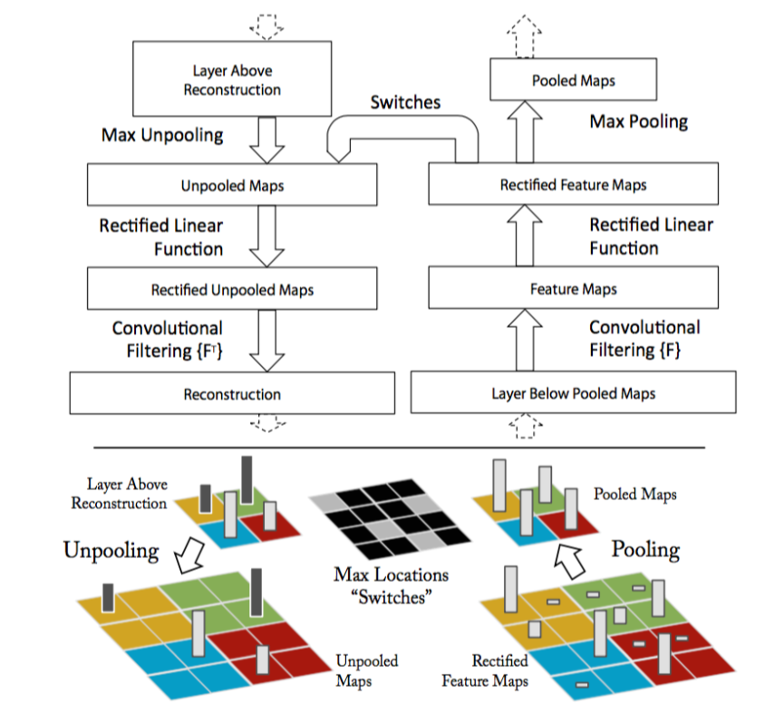

    image from [14]_.

Here, the paper introduces a structure called a deconvolutional layer. However, in practice, this is
simply a regular convolutional layer with its filters transposed. By applying these transposed filters
to the output of a convolutional layer, the input can be retrieved.

A max-pool gate cannot be reversed on its own, as data about the non-maximum features is lost. The paper
describes a method in which the positions of each maximum is recorded and saved during forward propagation,
and when features are passed backwards, they are placed where the maximums had originated from. In my
recreation, I took an even simpler route and just set the whole :math:`2x2` square equal to the
maximum activation.

Finally, the rectified linear unit. It's the easiest one to reverse, we just need to pass the data through
a reLu again when moving backwards.

To test these techniques out, I trained a standard convolutional network on CIFAR-10. First, I passed one
of the training images, a dog, through the network and recorded the various features.

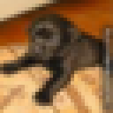

    our favorite dog.

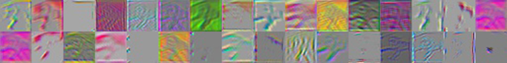

    first convolutional layer (features 1-32).

As you can see, there are quite a variety of patterns the network is looking for. You can see evidence
of the original dog picture in these feature activations, most prominently the arms.

Now, let's see how these features change when different images are passed through.

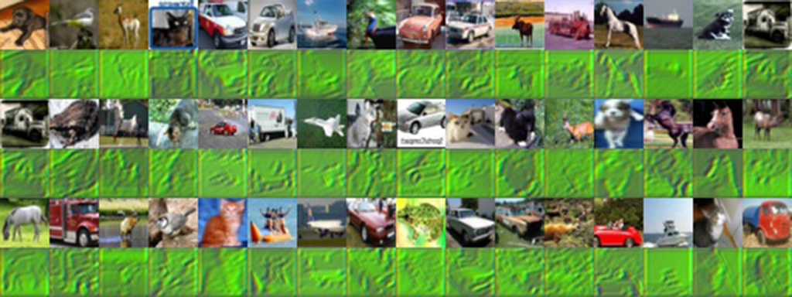

    first convolutional layer (feature #7).

This image shows all the different pixel representations of the activations of feature #7,
when a variety of images are used. It's clear that this feature activates when green is present.
You can really see the original picture in this feature, since it probably just captures the overall
color green rather than some specific pattern.

Finally, to gain some intuition of how images activated each feature, I passed in a whole batch of
images and saved the maximum activations.

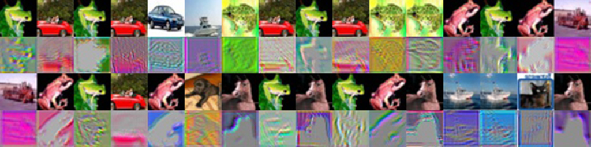

    maximum activations for 32 features.

Which features were activated by which images? There's some interesting stuff going on here. Some
of the features are activated simply by the presence of a certain color. The green frog and red car
probably contained the most of their respective colors in the batch of images.

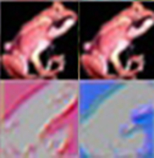

    two activations from the above image.

However, here are two features which are activated the most by a red frog image. The feature activations
show an outline, but one is in red and the other is in blue. Most likely, this feature isn't getting
activated by the frog itself, but by the black background. Visualizing the features of a convolutional
network allows us to see such details.

So, what happens if we go farther, and look at the second convolutional layer?

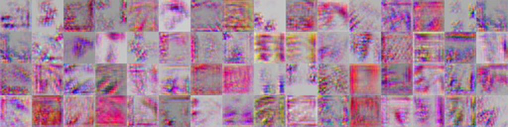

    second convolutional layer (64 features).

I took the feature activations for the dog again, this time on the second convolutional layer. Already
some differences can be spotted. The presence of the original image here is much harder to see.

It's a good sign that all the features are activated in different places. Ideally, we want features to
have minimal correlation with one another.

Finally, let's examine how a second layer feature activates when various images are passed in.

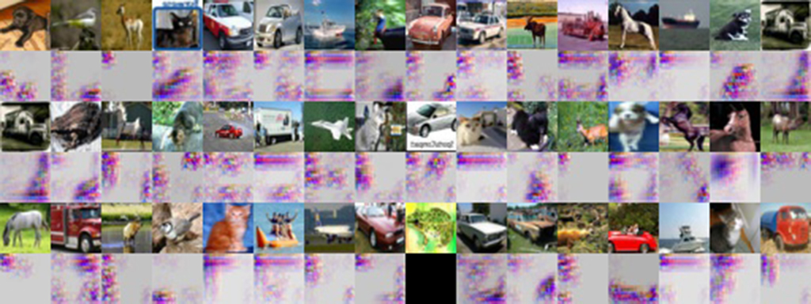

    second convolutional layer (feature #9).

For the majority of these images, feature #9 activated at dark locations of the original image. However,
there are still outliers to this, so there is probably more to this feature than that.

For most features, it's a lot harder to tell what part of the image activated it, since second layer
features are made of any linear combination of first layer features. I'm sure that if the network was
trained on a higher resolution image set, these features would become more apparent.

Code
====

.. literalinclude:: cnn_visualization.py
    :start-after: start
    :end-before: end

.. [1] http://caffe.berkeleyvision.org/
.. [2] http://cs224d.stanford.edu/
.. [3] https://www.udacity.com/course/deep-learning--ud730
.. [4] http://www.deeplearningbook.org/
.. [5] https://plus.google.com/+YoshuaBengio/posts
.. [6] https://www.quora.com/session/Andrew-Ng/1
.. [7] https://www.facebook.com/yann.lecun?fref=ts
.. [8] https://plus.google.com/111541909707081118542/posts/P8bZBNpg84Z
.. [9] http://www.johnloomis.org/ece563/notes/filter/conv/convolution.html
.. [10] http://neuralnetworksanddeeplearning.com/chap2.html
.. [11] https://en.wikipedia.org/wiki/Rectifier_(neural_networks)
.. [12] https://grzegorzgwardys.wordpress.com/2016/04/22/8/#unique-identifier
.. [13] http://neuralnetworksanddeeplearning.com/chap2.html#the_backpropagation_algorithm
.. [14] Zeiler, Matthew D., and Rob Fergus. "Visualizing and understanding convolutional networks." European conference on computer vision. Springer International Publishing, 2014.

