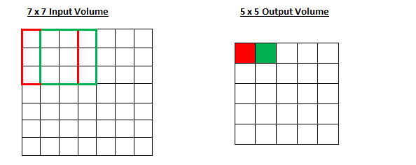
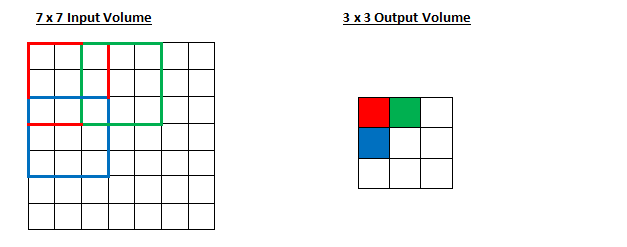
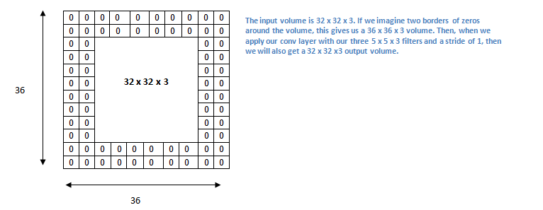
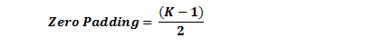
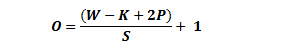
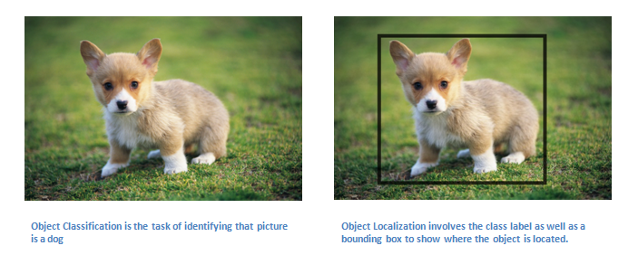

.. NumpyDL documentation master file, created by
   sphinx-quickstart on Mon Apr 10 13:33:52 2017.
   You can adapt this file completely to your liking, but it should at least
   contain the root `toctree` directive.

Convolution Neural Networks (Part 2)
====================================

Introduction
------------

In this post, we’ll go into a lot more of the specifics of ConvNets. Disclaimer: Now, I do realize that some of these topics are quite complex and could be made in whole posts by themselves. In an effort to remain concise yet retain comprehensiveness, I will provide links to research papers where the topic is explained in more detail.

Stride and Padding
------------------

Alright, let’s look back at our good old conv layers. Remember the filters, the receptive fields, the convolving? Good. Now, there are 2 main parameters that we can change to modify the behavior of each layer. After we choose the filter size, we also have to choose the stride and the padding.

Stride controls how the filter convolves around the input volume. In the example we had in part 1, the filter convolves around the input volume by shifting one unit at a time. The amount by which the filter shifts is the stride. In that case, the stride was implicitly set at 1. Stride is normally set in a way so that the output volume is an integer and not a fraction. Let’s look at an example. Let’s imagine a 7 x 7 input volume, a 3 x 3 filter (Disregard the 3rd dimension for simplicity), and a stride of 1. This is the case that we’re accustomed to.

Same old, same old, right? See if you can try to guess what will happen to the output volume as the stride increases to 2.

So, as you can see, the receptive field is shifting by 2 units now and the output volume shrinks as well. Notice that if we tried to set our stride to 3, then we’d have issues with spacing and making sure the receptive fields fit on the input volume. Normally, programmers will increase the stride if they want receptive fields to overlap less and if they want smaller spatial dimensions.

Now, let’s take a look at padding. Before getting into that, let’s think about a scenario. What happens when you apply three 5 x 5 x 3 filters to a 32 x 32 x 3 input volume? The output volume would be 28 x 28 x 3. Notice that the spatial dimensions decrease. As we keep applying conv layers, the size of the volume will decrease faster than we would like. In the early layers of our network, we want to preserve as much information about the original input volume so that we can extract those low level features. Let’s say we want to apply the same conv layer but we want the output volume to remain 32 x 32 x 3. To do this, we can apply a zero padding of size 2 to that layer. Zero padding pads the input volume with zeros around the border. If we think about a zero padding of two, then this would result in a 36 x 36 x 3 input volume.

If you have a stride of 1 and if you set the size of zero padding to

where K is the filter size, then the input and output volume will always have the same spatial dimensions.

The formula for calculating the output size for any given conv layer is

where O is the output height/length, W is the input height/length, K is the filter size, P is the padding, and S is the stride.

Choosing Hyper-parameters
-------------------------

How do we know how many layers to use, how many conv layers, what are the filter sizes, or the values for stride and padding? These are not trivial questions and there isn’t a set standard that is used by all researchers. This is because the network will largely depend on the type of data that you have. Data can vary by size, complexity of the image, type of image processing task, and more. When looking at your dataset, one way to think about how to choose the hyperparameters is to find the right combination that creates abstractions of the image at a proper scale.

ReLU (Rectified Linear Units) Layers
------------------------------------

After each conv layer, it is convention to apply a nonlinear layer (or activation layer) immediately afterward.The purpose of this layer is to introduce nonlinearity to a system that basically has just been computing linear operations during the conv layers (just element wise multiplications and summations).In the past, nonlinear functions like tanh and sigmoid were used, but researchers found out that ReLU layers work far better because the network is able to train a lot faster (because of the computational efficiency) without making a significant difference to the accuracy. It also helps to alleviate the vanishing gradient problem, which is the issue where the lower layers of the network train very slowly because the gradient decreases exponentially through the layers (Explaining this might be out of the scope of this post, but see here and here for good descriptions). The ReLU layer applies the function f(x) = max(0, x) to all of the values in the input volume. In basic terms, this layer just changes all the negative activations to 0.This layer increases the nonlinear properties of the model and the overall network without affecting the receptive fields of the conv layer.

`Paper <http://www.cs.toronto.edu/~fritz/absps/reluICML.pdf>`_ by the great Geoffrey Hinton (aka the father of deep learning).

Pooling Layers
--------------

After some ReLU layers, programmers may choose to apply a pooling layer. It is also referred to as a downsampling layer. In this category, there are also several layer options, with maxpooling being the most popular. This basically takes a filter (normally of size 2x2) and a stride of the same length. It then applies it to the input volume and outputs the maximum number in every subregion that the filter convolves around.

.. image:: pics/MaxPool.png
Other options for pooling layers are average pooling and L2-norm pooling. The intuitive reasoning behind this layer is that once we know that a specific feature is in the original input volume (there will be a high activation value), its exact location is not as important as its relative location to the other features. As you can imagine, this layer drastically reduces the spatial dimension (the length and the width change but not the depth) of the input volume. This serves two main purposes. The first is that the amount of parameters or weights is reduced by 75%, thus lessening the computation cost. The second is that it will control overfitting. This term refers to when a model is so tuned to the training examples that it is not able to generalize well for the validation and test sets. A symptom of overfitting is having a model that gets 100% or 99% on the training set, but only 50% on the test data.

Dropout Layers
--------------

Now, dropout layers have a very specific function in neural networks. In the last section, we discussed the problem of overfitting, where after training, the weights of the network are so tuned to the training examples they are given that the network doesn’t perform well when given new examples. The idea of dropout is simplistic in nature. This layer “drops out” a random set of activations in that layer by setting them to zero in the forward pass. Simple as that. Now, what are the benefits of such a simple and seemingly unnecessary and counterintuitive process? Well, in a way, it forces the network to be redundant. By that I mean the network should be able to provide the right classification or output for a specific example even if some of the activations are dropped out. It makes sure that the network isn’t getting too “fitted” to the training data and thus helps alleviate the overfitting problem. An important note is that this layer is only used during training, and not during test time.

`Paper <https://www.cs.toronto.edu/~hinton/absps/JMLRdropout.pdf>`_ by Geoffrey Hinton.

Network in Network Layers
-------------------------

A network in network layer refers to a conv layer where a 1 x 1 size filter is used. Now, at first look, you might wonder why this type of layer would even be helpful since receptive fields are normally larger than the space they map to. However, we must remember that these 1x1 convolutions span a certain depth, so we can think of it as a 1 x 1 x N convolution where N is the number of filters applied in the layer. Effectively, this layer is performing a N-D element-wise multiplication where N is the depth of the input volume into the layer.

`Paper <https://arxiv.org/pdf/1312.4400v3.pdf>`_ by Min Lin.

Classification, Localization, Detection, Segmentation
-----------------------------------------------------

In the example we used in Part 1 of this series, we looked at the task of image classification. This is the process of taking an input image and outputting a class number out of a set of categories. However, when we take a task like object localization, our job is not only to produce a class label but also a bounding box that describes where the object is in the picture.

We also have the task of object detection, where localization needs to be done on all of the objects in the image. Therefore, you will have multiple bounding boxes and multiple class labels.

Finally, we also have object segmentation where the task is to output a class label as well as an outline of every object in the input image.

Reference:

https://adeshpande3.github.io/adeshpande3.github.io/A-Beginner's-Guide-To-Understanding-Convolutional-Neural-Networks-Part-2/

