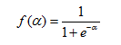
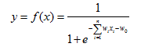
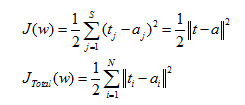
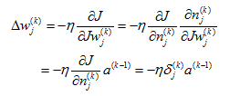

Multi-layer Perceptron （MLP）
============================

1. Sigmoid function
-------------------

BP algorithm is mainly due to the emergence of Sigmoid function, instead of the previous threshold function to construct neurons.

The Sigmoid function is a monotonically increasing nonlinear function. When the threshold value is large enough, the threshold function can be approximated.

.. figure:: pics/1.jpg

The Sigmoid function is usually written in the following form:

The value range is (-1,1), which can be used instead of the neuron step function:

Due to the complexity of the network structure, the Sigmoid function is used as the transfer function of the neuron. This is the basic idea of multilayer perceptron backpropagation algorithm.

2. BP
-----

BP algorithm is the optimization of the network through the iterative weights makes the actual mapping relationship between input and output and the desired mapping, descent algorithm by adjusting the layer weights for the objective function to minimize the gradient. The sum of the squared error between the predicted output and the expected output of the network on one or all training samples：

The error of each unit is calculated by layer by layer error of output layer:

Back Propagation Net (BPN) is a kind of multilayer network which is trained by weight of nonlinear differentiable function. BP network is mainly used for:

1) function approximation and prediction analysis: using the input vector and the corresponding output vector to train a network to approximate a function or to predict the unknown information;

2) pattern recognition: using a specific output vector to associate it with the input vector;

3) classification: the input vector is defined in the appropriate manner;

4) data compression: reduce the output vector dimension to facilitate transmission and storage.

For example, a three tier BPN structure is as follows:

.. figure:: pics/6(1).png

It consists of three layers: input layer, hidden layer and output layer. The unit of each layer is connected with all the units of the adjacent layer, and there is no connection between the units in the same layer. When a pair of learning samples are provided to the network, the activation value of the neuron is transmitted from the input layer to the output layer through the intermediate layers, and the input response of the network is obtained by the neurons in the output layer. Next, according to the direction of reducing the output of the target and the direction of the actual error, the weights of each link are modified from the output layer to the input layer.

 
3. Example
----------

Suppose you have such a network layer:

The first layer is the input layer, two neurons containing i1, i2, b1 and intercept; the second layer is the hidden layer, including two neurons h1, h2 and intercept b2, the third layer is the output of o1, o2 and wi are each line superscript connection weights between layers, we default to the activation function sigmoid function.
Now give them the initial value, as shown below:

.. figure:: pics/7(1).png

Among them, Input data i1=0.05, i2=0.10;
            Output data o1=0.01, o2=0.99;
            Initial weight w1=0.15, w2=0.20, w3=0.25, w4=0.30;
                           w5=0.40, w6=0.45, w7=0.50, w8=0.88;

Objective: to give input data i1, i2 (0.05 and 0.10), so that the output is as close as possible to the original output o1, o2 (0.01 and 0.99).

3.1. Step 1 Forward Propagation
^^^^^^^^^^^^^^^^^^^^^^^^^^^^^^^

1. Input layer ----> Hidden layer:

Calculate the input weighted sum of neurons h1:

.. figure:: pics/8(1).png

o1, the output of neuron h1: (Activation function sigmoid is required here):

.. figure:: pics/9(1).png

Similarly, o2, the output of neuron h2 can be calculated:

.. figure:: pics/10.png

2. Hidden layer ----> Output layer:

The values of o1 and o2 in the output layer are calculated:

.. figure:: pics/11.png

.. figure:: pics/12.png

This propagation process is finished, we get the output value of [0.75136079, 0.772928465], and the actual value of [0.01, 0.99] far from now, we for the error back-propagation, update the weights, to calculate the output.

3.2. Step 2 Back Propagation
^^^^^^^^^^^^^^^^^^^^^^^^^^^^

1. Calculate the total error

Total error: (square error)

.. figure:: pics/13.png

For example, the target output for o1 is 0.01 but the neural network output 0.75136507, therefore its error is:

.. figure:: pics/14.png

Repeating this process for o_2 (remembering that the target is 0.99) we get:

.. figure:: pics/15.png

The total error for the neural network is the sum of these errors:

.. figure:: pics/16.png

2. Hidden layer ----> Hidden layer weights update: 

Take the weight parameter w5 as an example, if we want to know how much impact the w5 has on the overall error, we can use the global error to obtain the partial derivative of w5: (chain rule)

.. figure:: pics/17.png

The following figure can be more intuitive to see how the error is spread back:

.. figure:: pics/18.png

Now we were calculated for each value:

Calculate

.. figure:: pics/19.png

.. figure:: pics/20.png

Calculate

.. figure:: pics/21.png

.. figure:: pics/22.png
(This step is actually a derivative of the sigmoid function)

Calculate

.. figure:: pics/23.png

.. figure:: pics/24.png

Putting it all together:

.. figure:: pics/25.png

In this way, we calculate the overall error E (total) to the w5 partial guide.
Look at the above formula, we found:

.. figure:: pics/26.png

In order to express convenience,.. figure:: pics/27.pngis used to express the error of output layer:

.. figure:: pics/28.png

Therefore, the overall error E (total) can be written as a partial derivative formula for w5:

.. figure:: pics/29.png

If the output layer error meter is negative, it can also be written:

.. figure:: pics/30.png

Finally, we update the value of w5:

.. figure:: pics/31.png

(Among them, .. figure:: pics/32.pngis the learning rate, here we take 0.5)

Similarly, update w6, w7, w8:

.. figure:: pics/33.png

3. Hidden layer ----> Hidden layer weights update:

In fact, with the method above said almost, but there is a need to change, calculate the total error of the above w5 guide, from out (o1) ---->net (o1) ---->w5, but in the hidden layer between the weight update, out (h1) ---->net (h1) ---->w1 and out (h1) will accept E(o1) and E(o2) error of two places to two, so this place will be calculated.

.. figure:: pics/34.png

Calculate

.. figure:: pics/35.png

.. figure:: pics/36.png

Calculate

.. figure:: pics/37.png

.. figure:: pics/38.png

.. figure:: pics/39.png

.. figure:: pics/40.png

.. figure:: pics/41.png

Similarly, calculate:

.. figure:: pics/42.png

Therefore:

.. figure:: pics/43.png

Then, calculate

.. figure:: pics/44.png

.. figure:: pics/45.png

Calculate

.. figure:: pics/46.png

.. figure:: pics/47.png

Putting it all together:

.. figure:: pics/48.png

In order to simplify the formula, sigma (h1) is used to represent the error of the hidden layer unit h1:

.. figure:: pics/49.png

We can now update w1:

.. figure:: pics/50.png

Repeating this for w2, w3, and w4:

.. figure:: pics/51.png

Finally, we’ve updated all of our weights! When we fed forward the 0.05 and 0.1 inputs originally, the error on the network was 0.298371109. After this first round of back propagation, the total error is now down to 0.291027924. It might not seem like much, but after repeating this process 10,000 times, for example, the error plummets to 0.000035085. At this point, when we feed forward 0.05 and 0.1, the two outputs neurons generate 0.015912196 (vs 0.01 target) and 0.984065734 (vs 0.99 target).

