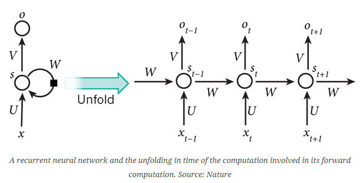
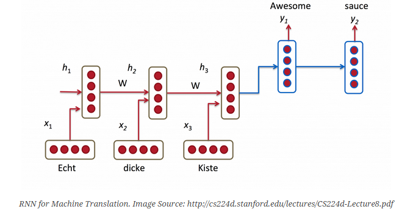
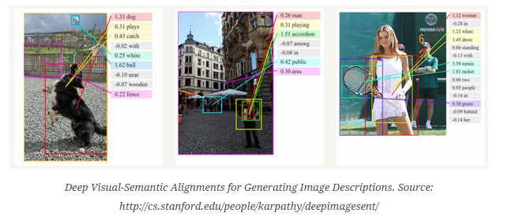
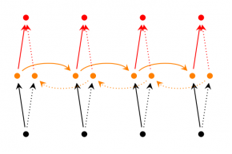
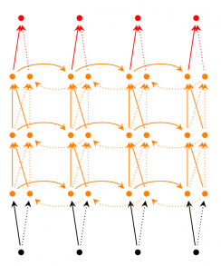

=========================
Recurrent Neural Networks
=========================

Recurrent Neural Networks (RNNs) are popular models that have shown great promise
in many NLP tasks. But despite their recent popularity I’ve only found a limited
number of resources that throughly explain how RNNs work, and how to implement
them. That’s what this tutorial is about.

1. Introduction to RNNs
=======================

As part of the tutorial we will implement a recurrent neural network based language
model. The applications of language models are two-fold: First, it allows us to
score arbitrary sentences based on how likely they are to occur in the real world.
This gives us a measure of grammatical and semantic correctness. Such models are
typically used as part of Machine Translation systems. Secondly, a language model
allows us to generate new text (I think that’s the much cooler application).
Training a language model on Shakespeare allows us to generate Shakespeare-like
text. This fun post by Andrej Karpathy demonstrates what character-level language
models based on RNNs are capable of.

I’m assuming that you are somewhat familiar with basic Neural Networks. If you’re
not, you may want to head over to Implementing A Neural Network From Scratch,
which guides you through the ideas and implementation behind non-recurrent networks.

WHAT ARE RNNS?
--------------

The idea behind RNNs is to make use of sequential information. In a traditional
neural network we assume that all inputs (and outputs) are independent of each
other. But for many tasks that’s a very bad idea. If you want to predict the
next word in a sentence you better know which words came before it. RNNs are
called recurrent because they perform the same task for every element of a
sequence, with the output being depended on the previous computations. Another
way to think about RNNs is that they have a “memory” which captures information
about what has been calculated so far. In theory RNNs can make use of information
in arbitrarily long sequences, but in practice they are limited to looking back
only a few steps (more on this later). Here is what a typical RNN looks like:

The above diagram shows a RNN being unrolled (or unfolded) into a full network.
By unrolling we simply mean that we write out the network for the complete sequence.
For example, if the sequence we care about is a sentence of 5 words, the network
would be unrolled into a 5-layer neural network, one layer for each word. The
formulas that govern the computation happening in a RNN are as follows:

- :math:`x_t` is the input at time step :math:`t`. For example, :math:`x_1` could
  be a one-hot vector corresponding to the second word of a sentence.

- :math:`s_t` is the hidden state at time step :math:`t`. It’s the “memory” of
  the network. :math:`s_t` is calculated based on the previous hidden state and
  the input at the current step: :math:`s_t=f(Ux_t + Ws_{t-1})`. The function :math:`f`
  usually is a nonlinearity such as ``tanh`` or ``ReLU``.  :math:`s_{-1}`, which
  is required to calculate the first hidden state, is typically initialized to all zeroes.

- :math:`o_t` is the output at step :math:`t`. For example, if we wanted to predict
  the next word in a sentence it would be a vector of probabilities across our
  vocabulary. :math:`o_t = \mathrm{softmax}(Vs_t)`.

There are a few things to note here:

- You can think of the hidden state :math:`s_t` as the memory of the network. :math:`s_t`
captures information about what happened in all the previous time steps. The output
at step :math:`o_t` is calculated solely based on the memory at time :math:`t`. As
briefly mentioned above, it’s a bit more complicated in practice because :math:`s_t`
typically can’t capture information from too many time steps ago.

- Unlike a traditional deep neural network, which uses different parameters at each
  layer, a RNN shares the same parameters (:math:`U`, :math:`V`, :math:`W` above) across
  all steps. This reflects the fact that we are performing the same task at each step,
  just with different inputs. This greatly reduces the total number of parameters
  we need to learn.

- The above diagram has outputs at each time step, but depending on the task this may
  not be necessary. For example, when predicting the sentiment of a sentence we may
  only care about the final output, not the sentiment after each word. Similarly,
  we may not need inputs at each time step. The main feature of an RNN is its hidden
  state, which captures some information about a sequence.

What can RNNs do?
-----------------

RNNs have shown great success in many NLP tasks. At this point I should mention that
the most commonly used type of RNNs are LSTMs, which are much better at capturing long-term
dependencies than vanilla RNNs are. But don’t worry, LSTMs are essentially the same thing
as the RNN we will develop in this tutorial, they just have a different way of computing
the hidden state. We’ll cover LSTMs in more detail in a later post. Here are some example
applications of RNNs in NLP (by non means an exhaustive list).

Language Modeling and Generating Text
.....................................

Given a sequence of words we want to predict the probability of each word given the
previous words. Language Models allow us to measure how likely a sentence is, which is
an important input for Machine Translation (since high-probability sentences are typically
correct). A side-effect of being able to predict the next word is that we get a generative
model, which allows us to generate new text by sampling from the output probabilities.
And depending on what our training data is we can generate all kinds of stuff. In Language
Modeling our input is typically a sequence of words (encoded as one-hot vectors for example),
and our output is the sequence of predicted words. When training the network we set :math:`o_t = x_{t+1}`
since we want the output at step t to be the actual next word.

Machine Translation
...................

Machine Translation is similar to language modeling in that our input is a sequence of
words in our source language (e.g. German). We want to output a sequence of words in
our target language (e.g. English). A key difference is that our output only starts after we
have seen the complete input, because the first word of our translated sentences may require
information captured from the complete input sequence.

Speech Recognition
...................

Given an input sequence of acoustic signals from a sound wave, we can predict a sequence
of phonetic segments together with their probabilities.

Generating Image Descriptions
.............................

Together with convolutional Neural Networks, RNNs have been used as part of a model to
generate descriptions for unlabeled pics. It’s quite amazing how well this seems to work.
The combined model even aligns the generated words with features found in the pics.

Training RNNs
-------------

Training a RNN is similar to training a traditional Neural Network. We also use the
backpropagation algorithm, but with a little twist. Because the parameters are shared
by all time steps in the network, the gradient at each output depends not only on the
calculations of the current time step, but also the previous time steps. For example,
in order to calculate the gradient at t=4 we would need to backpropagate 3 steps and sum
up the gradients. This is called Backpropagation Through Time (BPTT). If this doesn’t make
a whole lot of sense yet, don’t worry, we’ll have a whole post on the gory details. For now,
just be aware of the fact that vanilla RNNs trained with BPTT have difficulties learning
long-term dependencies (e.g. dependencies between steps that are far apart) due to what is
called the vanishing/exploding gradient problem. There exists some machinery to deal with
these problems, and certain types of RNNs (like LSTMs) were specifically designed to get
around them.

RNN Extensions
--------------

Over the years researchers have developed more sophisticated types of RNNs to deal with
some of the shortcomings of the vanilla RNN model. We will cover them in more detail in
a later post, but I want this section to serve as a brief overview so that you are familiar
with the taxonomy of models.

**Bidirectional RNNs** are based on the idea that the output at time t may not only depend
on the previous elements in the sequence, but also future elements. For example, to predict
a missing word in a sequence you want to look at both the left and the right context.
Bidirectional RNNs are quite simple. They are just two RNNs stacked on top of each other.
The output is then computed based on the hidden state of both RNNs.

**Deep (Bidirectional) RNNs** are similar to Bidirectional RNNs, only that we now have
multiple layers per time step. In practice this gives us a higher learning capacity
(but we also need a lot of training data).

**LSTM networks** are quite popular these days and we briefly talked about them above.
LSTMs don’t have a fundamentally different architecture from RNNs, but they use a different
function to compute the hidden state. The memory in LSTMs are called cells and you can
think of them as black boxes that take as input the previous state :math:`h_{t-1}` and current
input :math:`x_t`. Internally these cells  decide what to keep in (and what to erase from)
memory. They then combine the previous state, the current memory, and the input. It turns
out that these types of units are very efficient at capturing long-term dependencies.
LSTMs can be quite confusing in the beginning but if you’re interested in learning more
this post has an excellent explanation.

Conclusion
----------

So far so good. I hope you’ve gotten a basic understanding of what RNNs are and what
they can do. In the next post we’ll implement a first version of our language model RNN
using Python and Theano. Please leave questions in the comments!

2. Implementing a RNN with Python
=================================

In this part we will implement a full Recurrent Neural Network from scratch using Python
and optimize our implementation using Theano, a library to perform operations on a GPU.
The full code is available on Github. I will skip over some boilerplate code that is not
essential to understanding Recurrent Neural Networks.

Language Modeling
-----------------

Our goal is to build a Language Model using a Recurrent Neural Network. Here’s what that
means. Let’s say we have sentence of :math:`m` words. A language model allows us to predict the
probability of observing the sentence (in a given dataset) as:

.. math::

    \begin{aligned}
    P(w_1,...,w_m) = \prod_{i=1}^{m} P(w_i \mid w_1,..., w_{i-1})
    \end{aligned}

In words, the probability of a sentence is the product of probabilities of each word given
the words that came before it. So, the probability of the sentence “He went to buy some
chocolate” would be the probability of “chocolate” given “He went to buy some”, multiplied
by the probability of “some” given “He went to buy”, and so on.

Why is that useful? Why would we want to assign a probability to observing a sentence?

First, such a model can be used as a scoring mechanism. For example, a Machine Translation
system typically generates multiple candidates for an input sentence. You could use a
language model to pick the most probable sentence. Intuitively, the most probable sentence
is likely to be grammatically correct. Similar scoring happens in speech recognition systems.

But solving the Language Modeling problem also has a cool side effect. Because we can
predict the probability of a word given the preceding words, we are able to generate new
text. It’s a generative model. Given an existing sequence of words we sample a next word
from the predicted probabilities, and repeat the process until we have a full sentence.
Andrej Karparthy has a great post that demonstrates what language models are capable of.
His models are trained on single characters as opposed to full words, and can generate
anything from Shakespeare to Linux Code.

Note that in the above equation the probability of each word is conditioned on all previous
words. In practice, many models have a hard time representing such long-term dependencies
due to computational or memory constraints. They are typically limited to looking at only
a few of the previous words. RNNs can, in theory, capture such long-term dependencies, but
in practice it’s a bit more complex. We’ll explore that in a later post.

Training Data and Preprocessing
-------------------------------

To train our language model we need text to learn from. Fortunately we don’t need any
labels to train a language model, just raw text. I downloaded 15,000 longish reddit comments
from a dataset available on Google’s BigQuery. Text generated by our model will sound like
reddit commenters (hopefully)! But as with most Machine Learning projects we first need to
do some pre-processing to get our data into the right format.

1. Tokenize Text
................

We have raw text, but we want to make predictions on a per-word basis. This means we must
tokenize our comments into sentences, and sentences into words. We could just split each
of the comments by spaces, but that wouldn’t handle punctuation properly. The sentence
“He left!” should be 3 tokens: “He”, “left”, “!”. We’ll use NLTK’s word_tokenize and
sent_tokenize methods, which do most of the hard work for us.

2. Remove infrequent words
..........................

Most words in our text will only appear one or two times. It’s a good idea to remove these
infrequent words. Having a huge vocabulary will make our model slow to train (we’ll talk
about why that is later), and because we don’t have a lot of contextual examples for such
words we wouldn’t be able to learn how to use them correctly anyway. That’s quite similar
to how humans learn. To really understand how to appropriately use a word you need to have
seen it in different contexts.

In our code we limit our vocabulary to the vocabulary_size most common words (which I set
to 8000, but feel free to change it). We replace all words not included in our vocabulary
by UNKNOWN_TOKEN. For example, if we don’t include the word “nonlinearities” in our vocabulary,
the sentence “nonlineraties are important in neural networks” becomes “UNKNOWN_TOKEN are
important in Neural Networks”. The word UNKNOWN_TOKEN will become part of our vocabulary
and we will predict it just like any other word. When we generate new text we can replace
UNKNOWN_TOKEN again, for example by taking a randomly sampled word not in our vocabulary,
or we could just generate sentences until we get one that doesn’t contain an unknown token.

3. Prepend special start and end tokens
.......................................

We also want to learn which words tend start and end a sentence. To do this we prepend a
special SENTENCE_START token, and append a special SENTENCE_END token to each sentence.
This allows us to ask: Given that the first token is SENTENCE_START, what is the likely
next word (the actual first word of the sentence)?

4. Build training data matrices
...............................

The input to our Recurrent Neural Networks are vectors, not strings. So we create a mapping
between words and indices, index_to_word, and word_to_index. For example,  the word
“friendly” may be at index 2001. A training example x may look like :math:`[0, 179, 341, 416]`,
where 0 corresponds to SENTENCE_START. The corresponding label y would be :math:`[179, 341, 416, 1]`.
Remember that our goal is to predict the next word, so y is just the x vector shifted by
one position with the last element being the SENTENCE_END token. In other words, the correct
prediction for word 179 above would be 341, the actual next word.

.. code-block:: python

    import os
    import csv
    import itertools

    import nltk
    import numpy as np

    import npdl

    def load_data(corpus_path=os.path.join(os.path.dirname(__file__), 'data/lm/reddit-comments-2015-08.csv'),
                  vocabulary_size=8000):
        sentence_start_token = "SENTENCE_START"
        sentence_end_token = "SENTENCE_END"
        unknown_token = 'UNKNOWN_TOKEN'

        # Read the data and append SENTENCE_START and SENTENCE_END tokens
        with open(corpus_path, encoding='utf-8') as f:
            reader = csv.reader(f, skipinitialspace=True)
            # Split full comments into sentences
            sentences = [nltk.sent_tokenize(x[0]) for x in reader]
            sentences = itertools.chain(*sentences)
            # Append SENTENCE_START and SENTENCE_END
            sentences = ["%s %s %s" % (sentence_start_token, x, sentence_end_token) for x in sentences]

        # Tokenize the sentences into words
        tokenized_sentences = [nltk.word_tokenize(sentence) for sentence in sentences]

        # Count the word frequencies
        word_freq = nltk.FreqDist(itertools.chain(*tokenized_sentences))
        print("Found %d unique tokens in corpus '%s'." % (word_freq.B(), corpus_path))

        # Get the most common words and build index_to_word and word_to_index vectors
        vocab = word_freq.most_common(vocabulary_size - 1)
        print("The least frequent word in our vocabulary is '%s' and appeared %d times." %
              (vocab[-1][0], vocab[-1][1]))
        index_to_word = [x[0] for x in vocab]
        index_to_word.append(unknown_token)
        word_to_index = dict([(w, i) for i, w in enumerate(index_to_word)])

        # Replace all words not in our vocabulary with the unknown token
        tokenized_sentences = [[word if word in word_to_index else unknown_token for word in sentence]
                               for sentence in tokenized_sentences]
        # Create the training data
        train_x = np.asarray([[word_to_index[word] for word in sentence[:-1]] for sentence in tokenized_sentences])
        train_y = np.asarray([[word_to_index[word] for word in sentence[1:]] for sentence in tokenized_sentences])

        return index_to_word, word_to_index, train_x, train_y

    def main(max_iter, corpus_path=os.path.join(os.path.dirname(__file__), 'data/lm/tiny_shakespeare.txt')):
        raw_text = open(corpus_path, 'r').read()
        chars = list(set(raw_text))
        data_size, vocab_size = len(raw_text), len(chars)
        print("data has %s charactres, % unique." % (data_size, vocab_size))
        char_to_index = {ch: i for i, ch in enumerate(chars)}
        index_to_char = {i: ch for i, ch in enumerate(chars)}

        time_steps, batch_size = 30, 40

        length = batch_size * 20
        text_pointers = np.random.randint(data_size - time_steps - 1, size=length)
        batch_in = np.zeros([length, time_steps, vocab_size])
        batch_out = np.zeros([length, vocab_size], dtype=np.uint8)
        for i in range(length):
            b_ = [char_to_index[c] for c in raw_text[text_pointers[i]:text_pointers[i] + time_steps + 1]]
            batch_in[i, range(time_steps), b_[:-1]] = 1
            batch_out[i, b_[-1]] = 1

        print("Building model ...")
        net = npdl.Model()
        # net.add(model.layers.SimpleRNN(n_out=500, return_sequence=True))
        net.add(npdl.layers.SimpleRNN(n_out=500, n_in=vocab_size))
        net.add(npdl.layers.Softmax(n_out=vocab_size))
        net.compile(loss=npdl.objectives.SCCE(), optimizer=npdl.optimizers.SGD(lr=0.00001, clip=5))

        print("Train model ...")
        net.fit(batch_in, batch_out, max_iter=max_iter, batch_size=batch_size)

    if __name__ == '__main__':
        main(100)

