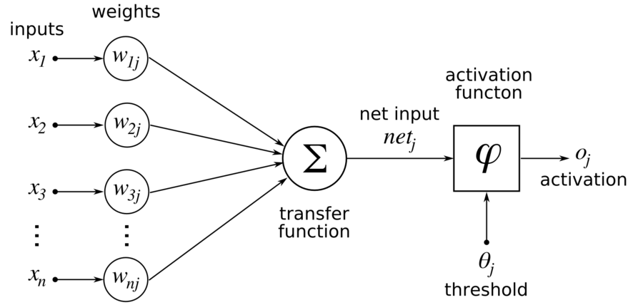
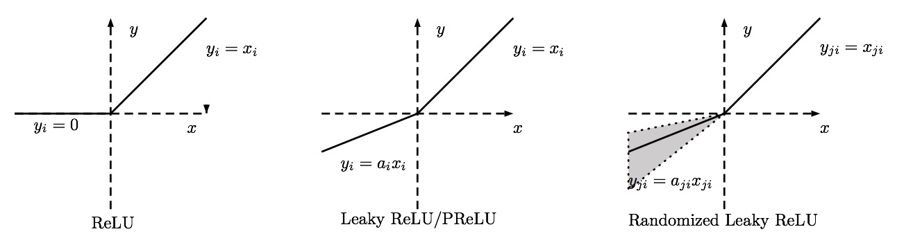

==========
Activation
==========

What is activation function?
============================

In computational networks, the activation function of a node defines the output of
that node given an input or set of inputs. In biologically inspired neural networks, the
activation function is usually an abstraction representing the rate of action potential
firing in the cell.

Why need activation function?
=============================

Neural networks compose several functions in layers: the output of a previous layer
is the input to the next layer. If you compose linear functions, these functions are all linear.
So the result of stacking several linear functions together is a linear function. Using a
nonlinear function makes the map from the input to the output nonlinear.

For example, a `ReLU` function's output is either 0 or positive. If the unit is 0, it is effectively
"off," so the inputs to the unit are not propagated forward from that function. If the unit is on,
the input data is reflected in subsequent layers through that unit. ReLU itself is not linear,
and neither is the composition of several layers of several ReLU functions. So the mapping from
inputs to classification outcomes is not linear either.

Without activation function many layers would be equivalent to a single layer, as each layer
(without an activation function) can be represented by a matrix and a product of many matrices is still a matrix:

.. math::

  M = M_1 M_2 \cdots M_n

Commonly used activation functions
==================================

Every activation function (or non-linearity) takes a single number and performs a
certain fixed mathematical operation on it. There are several activation functions
you may encounter in practice:

Sigmoid
-------

.. figure:: pics/act_1.png

  Sigmoid non-linearity squashes real numbers to range between :math:`[0,1]`.

The sigmoid non-linearity has the mathematical form :math:`σ(x)=1/(1 + e ^ {−x})` and is shown in the
image above. It takes a real-valued number and "squashes" it into range between 0 and 1.
In particular, large negative numbers become 0 and large positive numbers become 1. The
sigmoid function has seen frequent use historically since it has a nice interpretation as
the firing rate of a neuron: from not firing at all (0) to fully-saturated firing at an
assumed maximum frequency (1). In practice, the sigmoid non-linearity has recently fallen
out of favor and it is rarely ever used. It has two major drawbacks:

* *Sigmoids saturate and kill gradients*. A very undesirable property of the sigmoid neuron
  is that when the neuron's activation saturates at either tail of 0 or 1, the gradient at
  these regions is almost zero. Recall that during backpropagation, this (local) gradient
  will be multiplied to the gradient of this gate's output for the whole objective. Therefore,
  if the local gradient is very small, it will effectively "kill" the gradient and almost no
  signal will flow through the neuron to its weights and recursively to its data. Additionally,
  one must pay extra caution when initializing the weights of sigmoid neurons to prevent
  saturation. For example, if the initial weights are too large then most neurons would become
  saturated and the network will barely learn.
* *Sigmoid outputs are not zero-centered*. This is undesirable since neurons in later layers
  of processing in a Neural Network (more on this soon) would be receiving data that is not
  zero-centered. This has implications on the dynamics during gradient descent, because if the
  data coming into a neuron is always positive (e.g. :math:`x > 0` elementwise in :math:`f = w ^ T x + b`)),
  then the gradient on the weights :math:`w` will during backpropagation
  become either all be positive, or all negative (depending on the gradient of the whole
  expression :math:`f`). This could introduce undesirable zig-zagging dynamics in the gradient
  updates for the weights. However, notice that once these gradients are added up across a batch
  of data the final update for the weights can have variable signs, somewhat mitigating this issue.
  Therefore, this is an inconvenience but it has less severe consequences compared to the saturated
  activation problem above.

Tangent
-------

.. figure:: pics/act_2.png

    The tanh non-linearity squashes real numbers to range between :math:`[-1,1]`.

The tanh non-linearity is shown on the image above. It squashes a real-valued number to the
range :math:`[-1, 1]`. Like the `sigmoid` neuron, its activations saturate, but unlike
the sigmoid neuron its output is zero-centered. Therefore, in practice the tanh non-linearity is
always preferred to the sigmoid nonlinearity. Also note that the tanh neuron is simply a scaled
sigmoid neuron, in particular the following holds:

.. math::

    tanh(x) = 2σ(2x) − 1.

ReLU
----

.. figure:: pics/act_3.png

     Rectified Linear Unit (ReLU) activation function, which is zero when :math:`x < 0` and
     then linear with slope :math:`1` when :math:`x > 0`.

The Rectified Linear Unit has become very popular in the last few years. It computes the
function

.. math::

    f(x)=max(0,x)

In other words, the activation is simply thresholded at zero (see image above). There are
several pros and cons to using the ReLUs:

* (+) It was found to greatly accelerate (e.g. a factor of 6 in  Krizhevsky et al [1]_.)
  the convergence of stochastic gradient descent compared to the sigmoid/tanh functions.
  It is argued that this is due to its linear, non-saturating form.
* (+) Compared to `tanh`/`sigmoid` neurons that involve expensive operations (exponentials,
  etc.), the ReLU can be implemented by simply thresholding a matrix of activations at zero.
* (-) Unfortunately, ReLU units can be fragile during training and can "die". For example,
  a large gradient flowing through a ReLU neuron could cause the weights to update in such
  a way that the neuron will never activate on any datapoint again. If this happens, then
  the gradient flowing through the unit will forever be zero from that point on. That is,
  the ReLU units can irreversibly die during training since they can get knocked off the
  data manifold. For example, you may find that as much as 40\% of your network can be
  "dead" (i.e. neurons that never activate across the entire training dataset) if the
  learning rate is set too high. With a proper setting of the learning rate this is less
  frequently an issue.

.. figure:: pics/act_4.png

    A plot from Krizhevsky et al. [1]_ paper indicating the 6x improvement in convergence
    with the ReLU unit compared to the tanh unit.

Leaky ReLU
----------

Leaky ReLUs are one attempt to fix the "dying ReLU" problem. Instead of the function being
zero when :math:`x < 0`, a leaky ReLU will instead have a small negative slope (of :math:`0.01`,
or so). That is, the function computes

.. math:: f(x)= \left \{ \begin{aligned} αx  & &  x < 0 \\ x & &  x >= 0 \\ \end{aligned}  \right

where :math:`α` is a small constant. Some people report success with this form of activation
function, but the results are not always consistent. The slope in the negative region can also
be made into a parameter of each neuron, as seen in PReLU neurons, introduced in
`Delving Deep into Rectifiers, by Kaiming He et al., 2015` [2]_. However, the consistency of
the benefit across tasks is presently unclear.

Maxout
------

Other types of units have been proposed that do not have the functional form

.. math::

    f(wTx+b)

where a non-linearity is applied on the dot product between the weights and the data. One relatively
popular choice is the `Maxout` neuron (introduced recently by Goodfellow et al [3]_.) that generalizes
the ReLU and its leaky version. The Maxout neuron computes the function

.. math::

    max(w ^ T _ 1 x+b_1,w ^ T _ 2 x+b_2)

Notice that both `ReLU` and `Leaky ReLU` are a special case of this form (for example, for ReLU we
have :math:`w1,b1=0`). The `Maxout` neuron therefore enjoys all the benefits of a ReLU unit (linear
regime of operation, no saturation) and does not have its drawbacks (dying ReLU). However, unlike
the ReLU neurons it doubles the number of parameters for every single neuron, leading to a high total
number of parameters.

This concludes our discussion of the most common types of neurons and their activation functions.
As a last comment, it is very rare to mix and match different types of neurons in the same network,
even though there is no fundamental problem with doing so.

What activation should I use?
=============================

Use the `ReLU` non-linearity, be careful with your learning rates and possibly monitor the fraction
of “dead” units in a network. If this concerns you, give `Leaky ReLU` or `Maxout` a try. Never use
`sigmoid`. Try tanh, but expect it to work worse than ReLU/Maxout.

.. [1] Krizhevsky, Alex, Ilya Sutskever, and Geoffrey E. Hinton.
       "Imagenet classification with deep convolutional neural networks."
       Advances in neural information processing systems. 2012.

.. [2] He, Kaiming, et al. "Delving deep into rectifiers: Surpassing
       human-level performance on imagenet classification." Proceedings of
       the IEEE international conference on computer vision. 2015.

.. [3] Goodfellow, Ian J., et al. "Maxout networks." arXiv preprint arXiv:1302.4389 (2013).

